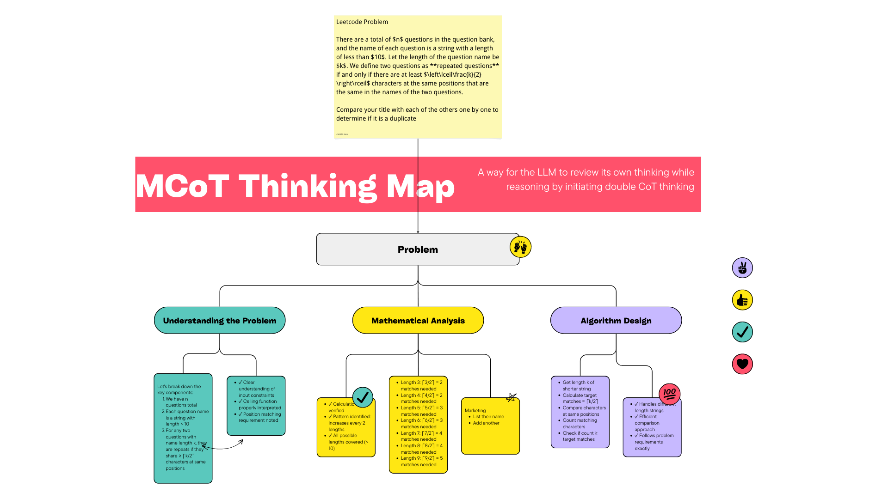

# Multiplex CoT: A way for the LLM to review its own thinking while reasoning by initiating double CoT thinking

By employing the Prompt method, the LLM can attain an effect that closely resembles that of the LRM without necessitating additional training.

In the context of reasoning and decision-making, Multiplex CoT (Chain of Thought) enables the model to simulate a form of self-reflection, improving its ability to generate coherent, logical answers. This method works by prompting the LLM to first generate a chain of reasoning (CoT), then iteratively reviewing and refining it by initiating a second round of reasoning, which acts as a critique or review of the first.

## Quickly start

Run `Multiplex_CoT.ipynb`.

## How to use

See `example.py`.
